# 普林斯顿微积分

## 1.1函数

f是变换规则,是一个函数.

>例如,f(x)=$x^2$ f将2变为4、将-1/2变为1/4, 将1变为1. 最后一个变换根本没有什么变化, 但这没问题, 因为转变后的对象不需要有别于原始对象.

定义域是变换的限制条件

值域是变换后实际获得的结果

上域是变换后可能获得的结果,从这点来看,上域的范围要比值域大,毕竟可能性是无限的(笑)

平方一个数, 其结果不可能是负数.当平方一个非负数时, 结果仍然会包括所有的非负数.非负数就是正数和0,为什么用非负数呢,这体现了数学的简洁性,毕竟说0和正数要用四个字,非负数只要用三个字就行了,好像也没差太多(笑)

>小贴士:R代表集合实数集。实数集是包含所有有理数和无理数的集合

### 1.1.1 区间表示法

"介于2和5之间的所有数,包括2但不包括5".这句话是不是感觉很罗嗦,我们来简化一下
简化中........
{x : 2 ≤ x < 5}
完成
是不是简单多了,不够吗?那就再简化一下
[2,5)堪称完美了

### 1.1.2 求定义域

我们知道取负数的平方根会出问题. (众所周知,负数是没有平方根的)那么还有什么会把问题搞糟呢？以下是三种最常见的情况.

1. 分数的分母不能是零.
2. 不能取一个负数的平方根 (或四次根, 六次根, 等等).
3. 不能取一个负数或零的对数. (还记得对数函数吗？若忘了, 请看看第9章!)

那么tan90呢,其实也是第一种情况,化简一下你就可以很轻松的看出来了

例题

$f(x)=\displaystyle\frac{\log_{10}(x+8)\sqrt{26-2x}}{(x-2)(x+19)}$

分析:

结论:$\sqrt{26-x}\geq0$
理由:(不能取一个负数的平方根)

结论:$\log_{10}(x+8)>0$
理由:(不能取一个负数或零的对数)

结论:$(x-2)\neq0$
$(x+19)\neq0$

理由:分数的分母不能是零.

这样就找到了其定义域是除了 2 以外的集合 (-8, 13]. 这个集合可以写作 (-8, 13] \ {2}, 这里的反斜杠表示 “不包括”.

### 1.1.3 利用图像求值域

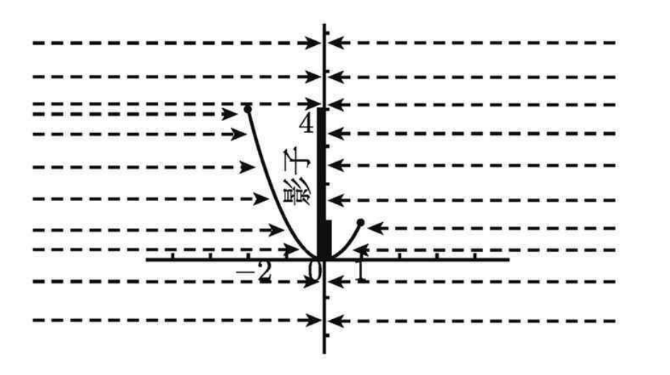

图 1-1中左侧的影子覆盖了y轴从0到4(包括0和4)的所有点,也就是[0,4];另一方面,右侧的影子覆盖了从0到1(包括0和1)的所有点,也就是[0,1].右侧的影子没有贡献更多,全部的覆盖范围仍然是[0,4].这就是函数F的值域

### 1.1.4 垂线检验

依据:在图像上没有两个点会落在相对于x轴的同一条垂线上.

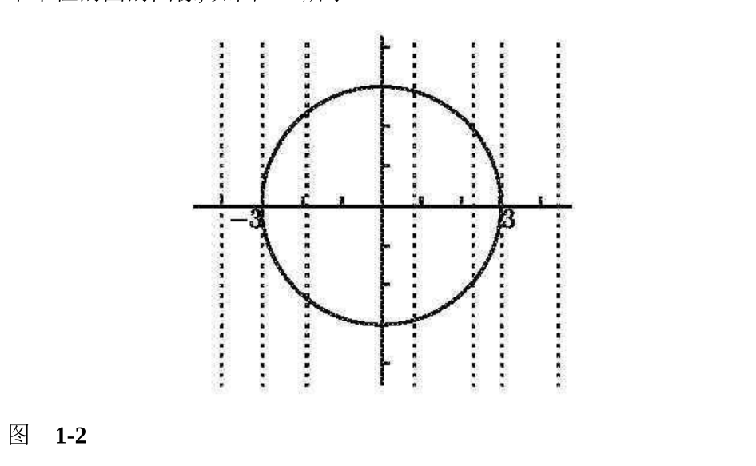

## 1.2 反函数

我们假设一个函数f,你给了它一个输入x.如果 x在f的定义域中,你就能得到一个输出,我们称它为f(x).现在,我们把过程倒过来, 并问：如果你选一个实数y,那么应该赋予f什么样的输入才能得到这个输出y呢？

数学语言描述:给定一个实数y,那么在f定义域中的哪个x满足f(x) = y？

>例如f(x)=$x^2$(其定义域为R),我们的问题是x取何值时会输出64. 很显然, 有两个x值：8和-8. 另外, 如果g(x)=$x^3$, 对于相同的问题, 这时只有一个x值,就是4.因为任何数都只有一个(实数)立方根. 

给定一个函数f,在f的值域中选择y.在理想状况下, 仅有一个x值满足f(x) = y. 如果上述理想状况对于值域中的每一个y来说都成立, 那么就可以定义一个新的函数, 它将逆转变换. 从输出y出发,这个新的函数发现一个且仅有一个输入x满足f(x) = y. 这个新的函数称为f 的反函数, 并写作$f^{-1}$

数学语言对上述情形的总结

1. 从一个函数f出发,使得对于在f值域中的任意y,都只有唯一的x值满足f(x)=y.也就是说,不同的输入对应不同的输出.现在,我们就来定义反函数$f^{-1}$.
2. $f^{-1}$的定义域和f的值域相同.
3. $f^{-1}$的值域和f的定义域相同.
4. $f^{-1}$的值就是满足f(x)=y的x.所以,如果f(x)=y,那么$f^{-1}$(y)=x.

>变换$f^{-1}$就像是 f 的撤销按钮：如果你从x出发,并通过函数 f 将它变换为 y ,那么你可以通过在 y 上的反函数$f^{-1}$来撤销这个变换效果,取回 x.

思考:

>你如何知道只有唯一的x值满足f(x) = y 呢？如果是这样, 如何求得反函数呢, 其图像又是什么样子呢？如果不是这样, 你又如何挽救这一局面呢？

### 1.2.1 水平线检验

如果每一条水平线和一个函数的图像相交至多一次,那么这个函数就有一个反函数.如果即使只有一条水平线和图像相交多于一次,那么这个函数就没有反函数.

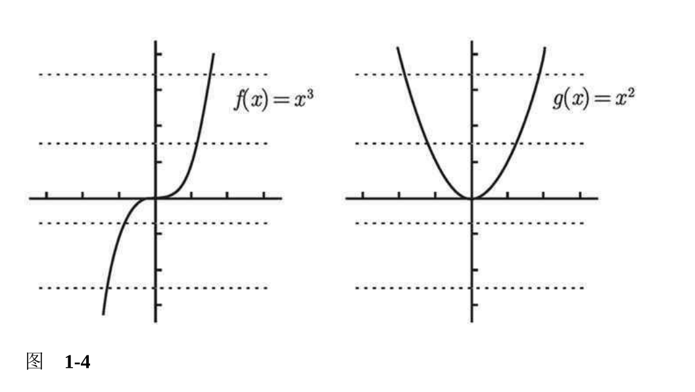

没有一条水平线和 y =f(x) 相交多于一次, 所以 f 有一个反函数.另一方面,一些水平线和曲线 y =g(x) 相交两次, 所以g没有反函数. 这里的问题在于：如果通过y = $x^2$来求解x, 其中 y 为正, 那么就会出现两个解:$\sqrt{y}$和$-\sqrt{y}$结果你不知道该取哪一个.

### 1.2.2 求反函数

如何求得函数 f 的反函数呢？

答案:$f^{-1}(x)=\sqrt[3]{x}$

分析:

因为f(x)=$x^3$也就是y=$x^3$

所以x=$\sqrt[3]{y}$也就意味着$f^{-1}(y)=\sqrt[3]{y}$

当然了y是可以换成x的,如下

$f^{-1}(x)=\sqrt[3]{x}$

这样就完成了,当然了,求解 x 并不总是那么简单.事实上, 求解经常是不可能的.

如果你知道函数图像是什么样子的,反函数的图像就会很容易画出来.基本思想是,在图像上画一条 y = x 的直线, 然后将这条直线假想为一个双面的镜子.反函数就是原始函数的镜面反射. 

如果 f (x) = x3, 那么 $f^{-1}$ 的图像如图 1-5 所示.

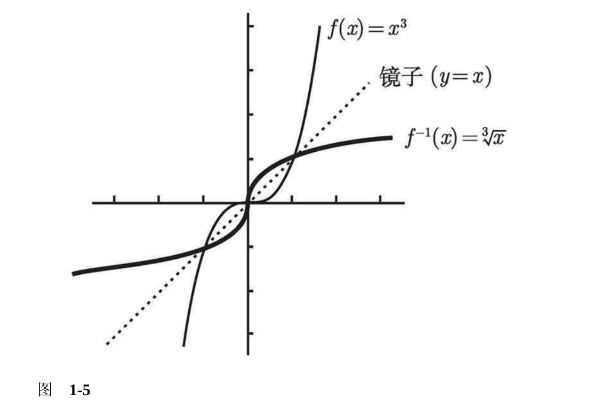

原始函数 f 在 y = x 这面 “镜子” 中被反射, 从而得到反函数. 注意：f 和 $f^{-1}$ 的定义域和值域都是整个实轴.

### 1.2.3 限制定义域

如果水平线检验失败因而没有反函数, 那应该怎么办呢？

除了这多个 x 值中的一个, 我们放弃所有其他值.

例如 g (x) = $x^2$, 可以删除左半边的图像, 如图 1-6 所示.

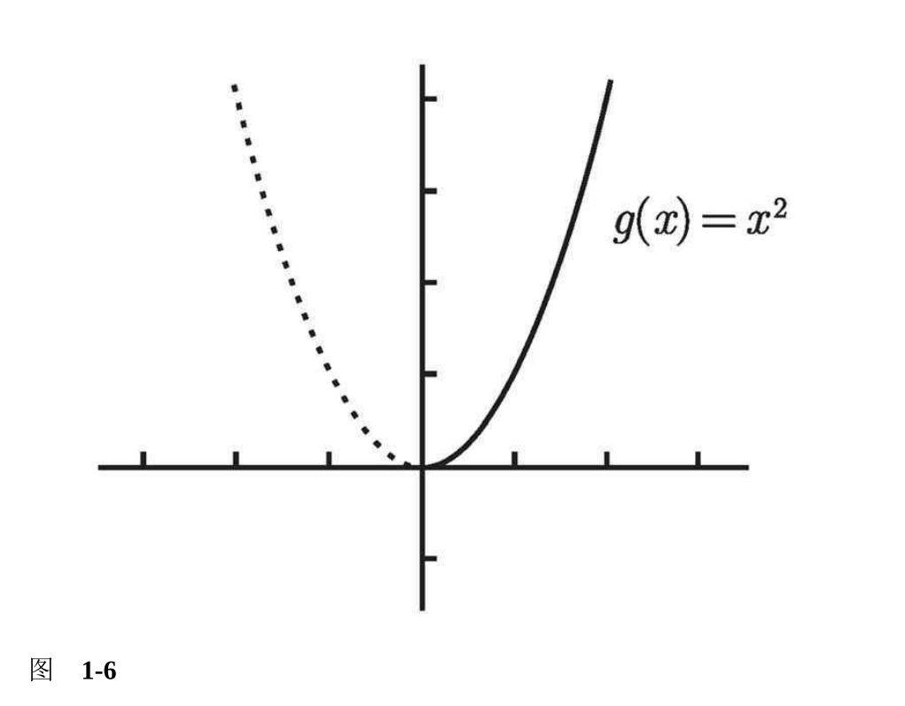

这条新的 (实线的) 曲线将定义域缩减为[0, ∞), 并且满足水平线检验, 所以它有反函数. 更确切地说,定义在定义域[0, ∞)上的函数 h 有反函数, 其中 h(x) = $x^2$.

### 1.2.4 反函数的反函数

如果 f 有反函数, 那么对于在 f 定义域中的所有 x, $f^{-1} (f (x)) = x$成立; 同样, 对于在 f 值域当中的所有 y, 都有$f^{-1}(f (y)) = y$. (记得, f 的值域和$f ^{-1}$的定义域相同, 所以对于 f 值域中的 y, 我们确实可 以取到 $f ^{-1}(y)$, 不会导致任何曲解. )

>例如 f (x) = $x^3$, $f^{-1}(x)=\sqrt[3]{x}$ 的反函数由 给出, 所以对于任意的 x, $f^{-1}(f(x))=\sqrt[3]{x}=x$ 不要忘记, 反函数就像是撤销按钮. 我们使用 x 作为f 的输入, 然后给出输出到 f -1; 这撤销了变换并让我们取回了 x 这个原始 的数. 类似地,$f(f^{-1}(y))=\sqrt[3]{y^3}$所以, $f^{-1}$是 f 的反函数, 且 f 是 $f^{-1}$的反函数.一句话,反函数的反函数就是原始函数.

**重点:**

* 如果一个函数 f 的定义域可以被限制, 使得 f 有反函数$f^{-1}$, 那么 
* 对于 f 值域中的所有 y, 都有 f ($f^{-1}$(y)) = y ; 但是
* $f^{-1}$ (f (x)) 可能不等于 x ; 事实上, $f^{-1}$(f (x)) = x 仅当 x 在限制的定义域中才成立.

## 1.3 函数的复合

定义一个函数$f (x) = cos(x)^2$,仔细观察,发现它有两个函数组成,像这样的有两个或两个以上的函数组成,我们称为复合函数.

如何求解呢

我们令 $g(x) = x^2, h(x) = cos(x)$先将 x 输入到函数 g 进行求平方运算, 接着不必返回 g 的结果而直接让 g 将其结果作为函数 h 的输入, 然后 h 计算出一 个最终的结果值, 该结果值当然是由函数 g 计算出的 x 平方值的余弦值.

>小贴士:这里需要小心的是, 我们把 h 写在 g 的前面 (像平常一 样从左向右读), 但计算时我们要先从 g 开始. 我承认这确实容易让人搞混, 但我也没办法 ——你只能试着去接受

练习1

若 g(x) = 2x, h(x) = 5x4, j(x) = 2x - 1, 则函数 f = g ○ h ○ j 的表达式是什么？ 

分析:

我们只需从 j 开 始, 将其代换到 h, 接着再将结果代换到 g, 可得

答案:

$f(x)=g(h(j(x)))=g(h(2x-1))=g(5(2x-1))^4=2^{5(2x-1)^4}$

练习2

假定存在一个函数$f(x)=\frac{1}{tan(5log_2(x+3))}$如何将 f 分解为几个简单函数呢？

分析:

从函数式中找到 x, 首先需要加 3, 所以设 g(x) = x + 3; 然后要对所得值取以2 为底的对数, 所以令 h(x) = log2(x); 接着需乘 5, 则设 j(x) = 5x ; 再接着要求正切值, 因此令 k(x) = tan(x); 最后要取倒数, 于是令 m(x) = 1/x. 

答案:

f(x)=m(k(j(h(g(x)))))

当然了,也有另一种表达方式,不得不说数学确实非常灵活,下面给出用复合符号的另一个答案

 f = m ○ k ○ j ○ h ○ g

 >注意,函数的复合并不是把它们相乘. 例如 $f (x) = x^2 sin(x)$, f 不是两个函数的复合, 因为对任意给定的 x, 计算 f (x) 的值需要求解 x2 和 sin(x)(先求 哪个值都没关系, 这与复合函数不同), 然后将这两个值乘起来.

 **重点**

 函数的乘积和复合是不同的, 且函数的复合与函数顺序有关系, 而函数的乘积与函数顺序无关.

 $y = (x + 2)^2$ 的图像是将 $y = x^2$ 的图像向左平移 2 个单位, 可把 (x + 2) 理解为 (x - (-2)).

 ## 1.4 奇函数和偶函数

问题:偶函数是什么

答案:如果对 f 定义域里的所有 x 有 f (-x) = f (x)则 f 是偶函数

分析:我们定义一个 $f (x) = x^2$ 的函数 f , 任选一个正数(我选 3) 作用于函数 f (得到 9). 现在取该数的负值, 由我选择的数可得 -3, 将其作用于函数 f (又得到 9). 发现两次变换的值是相同的.f (-x) = f (x)

问题:奇函数是什么

答案:当对 f 定义域内所有 x 都有 f (-x) = -f (x) 时, f 是奇函数.

分析:我们定义一个函数 $f (x)= x^3$选择你喜欢的任一正数 (我仍 选 3) 作用于 f (得到 27). 用你选的数的负值再试一遍, 我的数的负值是 -3, 得到 -27,两次变换互为相反f (-x) = -f (x) 

>一般而言, 一个函数可能是奇的, 可能是偶的, 也可能非奇非偶. 要记住这一点, 大多数函数是非奇非偶的. 另一方面, 只有一个函数是既奇 又偶的, 它就是非常单调的对所有 x 都成立的 f (x) = 0(我们称之为零函数).

### 偶函数图像

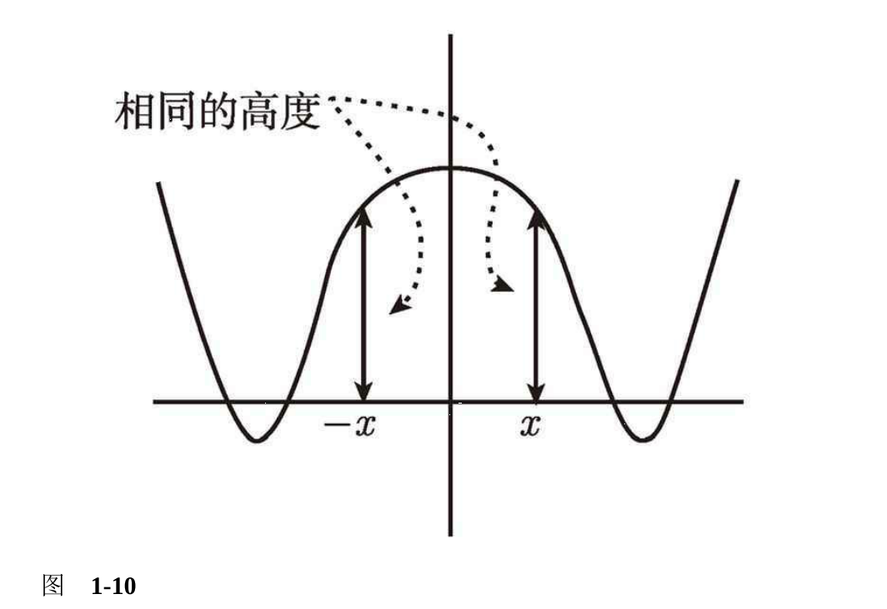

偶函数的图像关于 y 轴具有镜面对称性.

### 奇函数图像

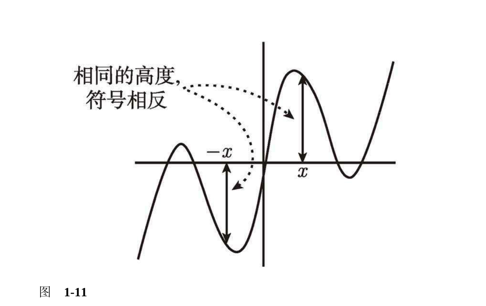

即奇函数的图像关于原点有180°的点对称性.

练习1

假设 f 定义为 $f (x) = log_5(2x^6 - 6x^2 + 3)$, 你怎么确定 f 是奇函数、偶函数, 还是都不是呢？

分析:
满足$f(-x)=f(x)$是偶函数
满足$f(-x)=-f(x)$是奇函数
我们将每个 x 替换为 (-x) 并计算 f (x), 一定要记着给 -x 加上小括号, 然后化简结果. 如果你得出了原始表达式 f (x), f 就是偶的; 如果得到原始表达式的负值 -f (x), f 就是奇的; 如果得到的结果一团糟, 既不是 f (x) 也不是 =f (x), 则 f 就非奇非偶 (或之前的化简不充分)

解:$f(-x)=log_5(2(-x^6)-6(-x)^2+3)=log_5(2x^6-6x^2+3)$

因此,f是偶函数

练习2

1. 判断函数$g(x)=\displaystyle\frac{2x^3+x}{3x^2+5}$的奇偶性

解:$g(-x)=\displaystyle\frac{2(-x)^3+(-x)}{3(-x^2)+5}=\frac{-2x^3-x}{3x^2+5}$
将负号提前,得到$g(-x)=\displaystyle\frac{2x^3+x}{3x^2+5}$

因此,f是奇函数

2. 判断函数$h(x)=\displaystyle\frac{2x^3+x-1}{3x^2+5}$的奇偶性

解:$h(-x)=\displaystyle\frac{2(-x)^3+(-x)-1}{3(-x)^2+5}
=\displaystyle\frac{-2x^3-x-1}{3x^2+5}
$
将负号提前,得到$h(-x)=-\displaystyle\frac
{2x^3+x+1}{3x^2+5}$

不是原始函数的负值,也不是原始函数

因此,h是非奇非偶函数

>若想证明两个奇函数之积是偶函数, 该怎么做呢？先给事物命名比较利于讨论, 我们就定义有两个奇函数 f 和 g. 我们 需要看一下它们的乘积, 因此定义它们的积为 h, 即定义了 h(x) = f (x)g(x), 而我们的任务是要证明 h 是偶的. 像往常一样, 我们需要证明 h(-x) = h(x). 因 f 和 g 都是奇的, 注意到 f (-x) = -f (x), g(-x) = -g(x) 会有所帮助. 我们从 h(-x) 开始. 由于 h 是 f 和 g 的乘积, 有 h(-x) = f (-x)g(-x). 再利用 f 和 g 的 奇函数性质将等式右边表示为 (-f (x))(-g (x)), 负号提到前面消掉, 由此得 到 f (x)g(x), 而它当然等于 h(x).

## 1.5 线性函数的图像

形如 f (x) = mx + b 的函数叫作线性函数. 如此命名原因很简单, 因为它们 的图像是直线. 直线的斜率是 m. 设想一下, 此时此刻你就在这页纸中, 这 条直线就像是座山, 你从左向右开始登山, 如图 1-12 所示.

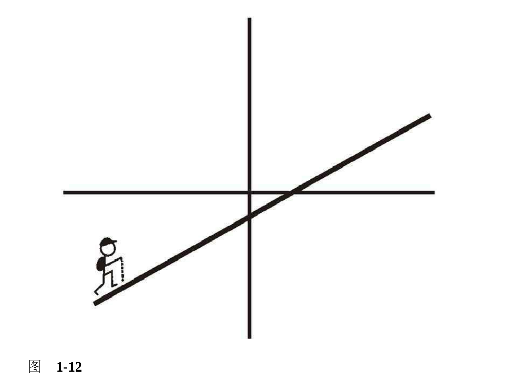

如果像上图一样, 斜率 m 为正数, 那么你正在上山. m 越大, 这段上坡就越 陡. 相反, 如果 m 为负数, 那么你正在下山. m 的数值越小 (即绝对值越 大), 这段下坡也就越陡. 如果斜率为 0, 这段山路就是水平的, 你既不在上 山, 也不在下山, 仅仅是在沿一条直线前行.

**如何找y轴的截距?**

答案:设 x = 0, 很显然 y = m × 0 + b = b. 也就是 说, y 轴的截距为 b, 所以直线通过 (0, b) 这点.

**如何找x轴的截距?**

答案:设 y 为 0, 求 x 的值. 

**有两种特殊情况不适用**

1. b = 0, 这时函数变为 y = mx. 直线通过原点, x 轴和 y 轴的截距都为零.
2. 当 m = 0, 这时函数变为 y = b, 是一条通过 (0, b) 的水平直线.

**叫直线方程的点斜式, 其文字表达如下**

如果已知直线点$(x_0,y_0)$,斜率为m,则它的方程$y-y_0=m(x-x_0)$

练习

如果已知一条直线通过(-2,5),斜率为-3,如何求它的方程?

分析:如果已知直线点$(x_0,y_0)$,斜率为m,则它的方程$y-y_0=m(x-x_0)$

解:y-5=-3(x-(-2)),化简后结果为y=-3x-1

**有时你不知道直线的斜率, 但知道它通过哪两点. 那怎样求它的方程**

如果一条直线通过点$(x_1,y_1)和(x_2,y_2)则它的斜率等于\displaystyle\frac{y_2-y_1}{x_2-x_1}$

练习

**例如, 通过 (-3, 4) 和 (2, -6) 的直线方程是什么？**

$分析:如果一条直线通过点(x_1,y_1)和(x_2,y_2)则它的斜率等于\displaystyle\frac{y_2-y_1}{x_2-x_1}$

$解:斜率=\displaystyle\frac{-6-4}{2-(-3)}=\frac{-10}{5}=-2$

>我们现在知道该直线通过 (-3, 4), 斜率为 -2, 所以它的方程为 y - 4 = -2(x (-3)), 化简后为 y = -2x - 2. 同样, 我们也可以使用另一点 (2, -6) 和斜率为 -2, 得出方程为 y - (-6) = -2(x - 2), 化简后为 y = -2x - 2. 你会发现, 无论使 用哪一个点, 最后得到的结果都是相同的.

## 1.6 常见函数及其图像

从 $x_0$ 到 $x_7$ 的图像.

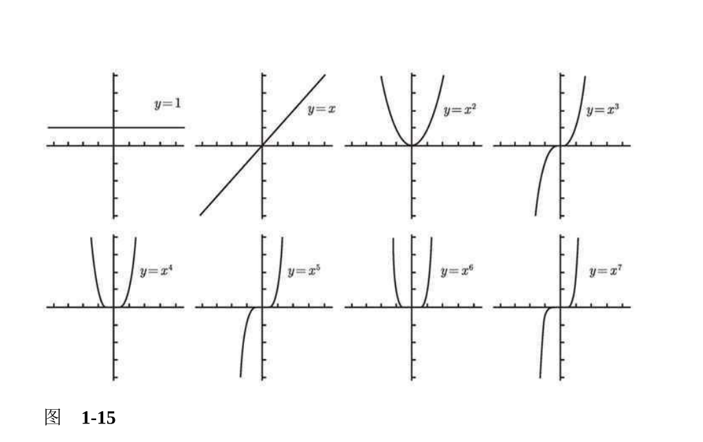

多项式图像左右两端的走势

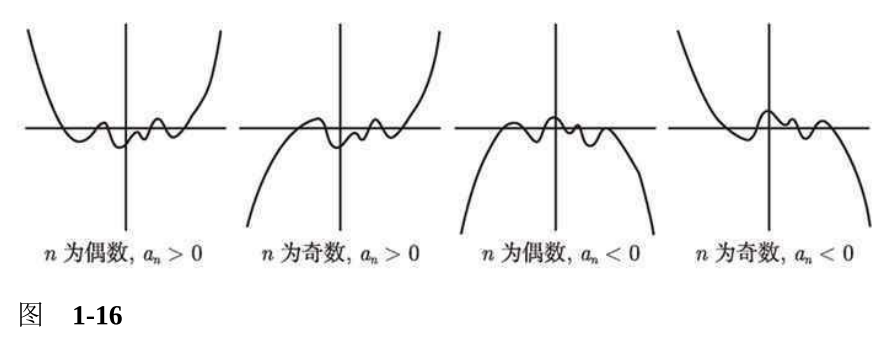

**如何判断二次函数到底有两个、一个还是没有实数解?**
>p(x) = $ax^2 + bx + c$. 根据判别式的符号可以判断二次函数到底有两个、一个还是没有实数解. 通常我们用希腊字母 Δ 来表示判别式 Δ = $b^2 - 4ac$. 它共有三种可能性. 如果 Δ > 0, 有两个不同的解; 如果 Δ = 0, 只有一个解, 也可以说有两个相同的解; 如果 Δ < 0, 在实数范围内无解.对于前两种情况,
解为$-b\pm\sqrt{b^2-4ac}$

配方法

有理函数的一些图像

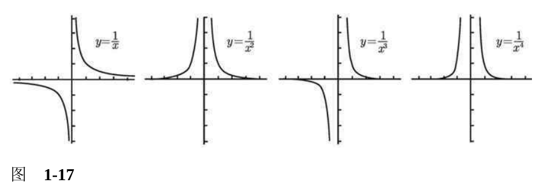

指数函数的图像

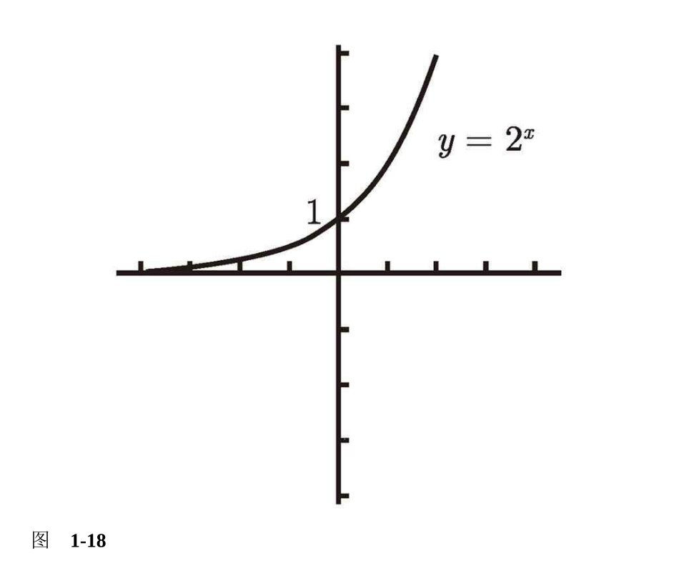

该函数的定义域为全体实数; 其次, y 轴的截距为 1 并且值域为大于零的实数; 最后, 左 端的水平渐近线为 x 轴. 再强调一下该图像非常接近于 x 轴, 但永远不会接触到 x 轴.

y = $2^{-x}$ 的图像是 y = $2^x$ 关于 y 轴的对称,如下

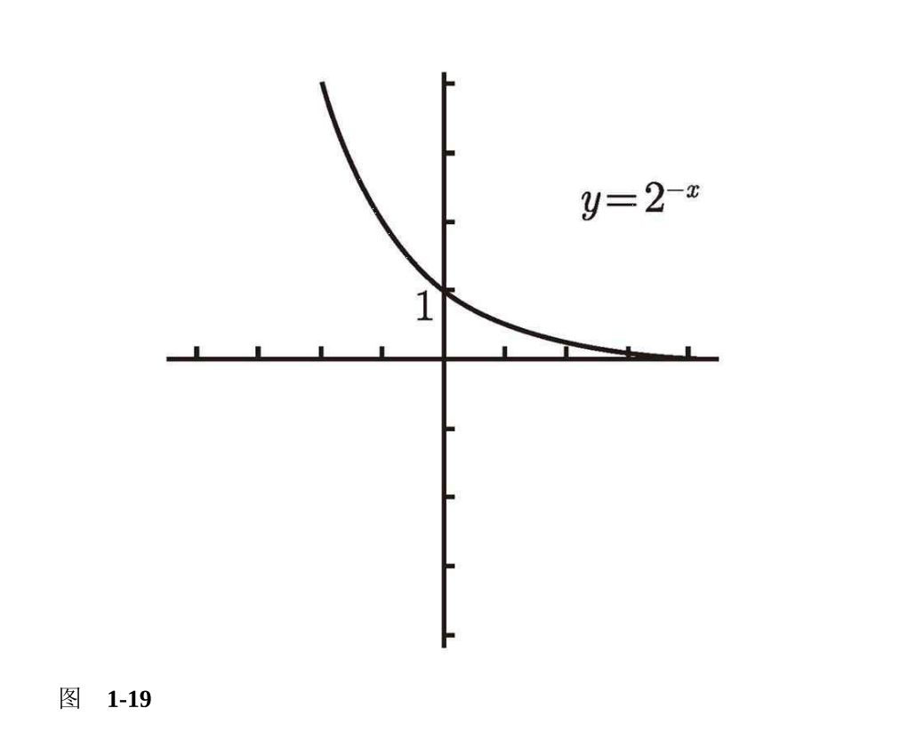

**如果底小于 1, 情况会是怎样？**

考虑$y=\displaystyle(\frac{1}{2})^x$注意到$\displaystyle(\frac{1}{2})^x=1/2^x=2^{-x}$

图像和1-19相同

**由于 y = 2x 的图像满足水平线检验, 所以该函数有反函数. 这个反函数就 是以 2 为底的对数 y = log2(x). 以直线 y = x 为镜子, y = log2(x) 如图 1-20 所示.**

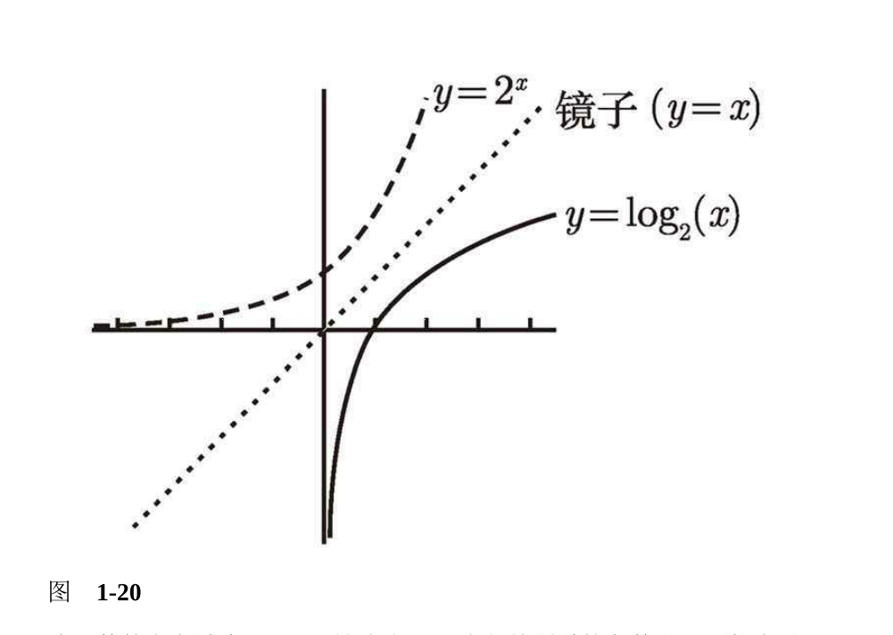

三角函数

带有绝对值的函数

